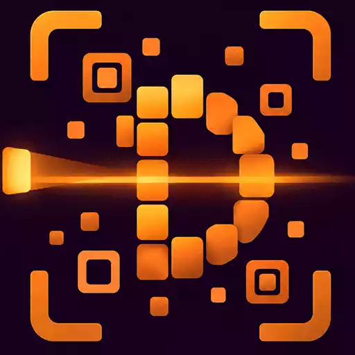
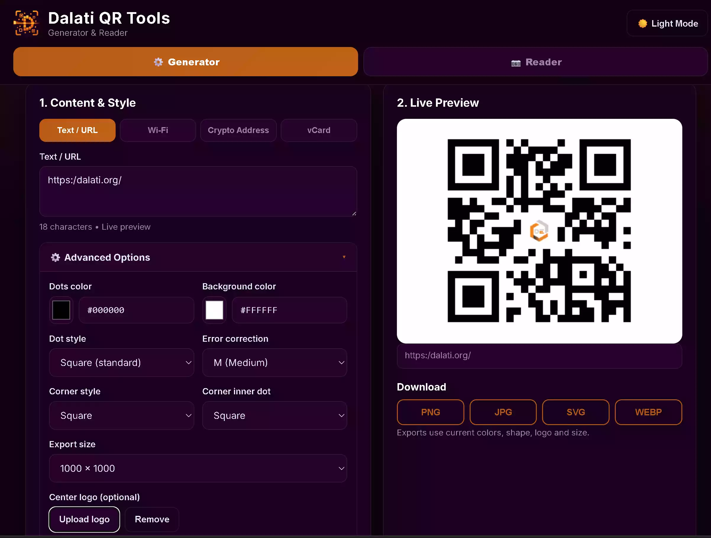
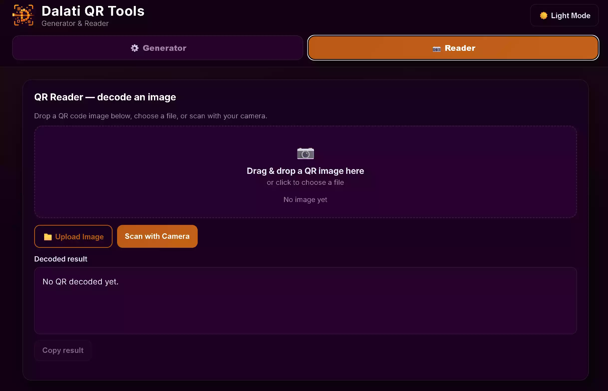
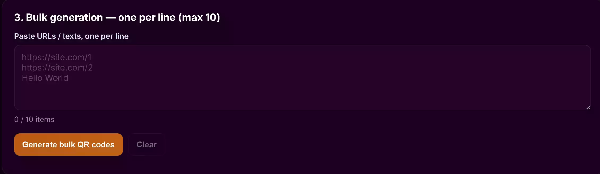

  <h3>🌍 <a href="README.md">English</a> | العربية 🌍</h3>

---

# Dalati QR Tools 🔳

**أدوات (Dalati QR Tools)** هو تطبيق ويب آمن يعمل بالكامل على جهة العميل (Client-side)، مصمم لتوليد وتخصيص وقراءة رموز QR فوراً من متصفحك. تم بناء التطبيق باستخدام تقنيات الويب الحديثة، وهو يضمن الخصوصية المطلقة من خلال معالجة جميع البيانات محلياً دون رفع أي بيانات إلى الخوادم.

🌐 **التطبيق المباشر:** [qr.dalati.org](https://tech.dalati.org/qr)

**المطور:**
تمت برمجة وتطوير هذا البرنامج بواسطة رامي الدالاتي (مطور برمجيات، وصانع محتوى رقمي، ومؤسس منصة **Dalati English**). وبروح الشفافية المطلقة، تم بناء هذا المشروع بالاستعانة بأدوات الذكاء الاصطناعي لتسريع عملية التطوير وضمان أعلى معايير جودة الكود، وتجربة المستخدم (UX/UI)، والأمان. للمزيد من الأدوات والمحتوى التعليمي، قم بزيارة موقعنا الرسمي: [dalati.org](https://dalati.org).

---

### 📸 واجهة التطبيق

إليك نظرة على واجهة المستخدم الاحترافية بالوضع المظلم:

#### ⚙️ مولّد رموز QR

_تخصيص متقدم يشمل قوالب البيانات، والألوان، وأنماط النقاط، والتصدير بدقة عالية._

#### 📷 قارئ رموز QR

_قراءة فورية للرموز عبر السحب والإفلات، أو رفع الملفات المباشر، أو المسح المباشر عبر الكاميرا._

#### 📚 التوليد المتعدد (Bulk Generation)

_توليد ما يصل إلى 10 رموز QR في وقت واحد بنقرة واحدة._

---

### الميزات الرئيسية 🚀

- **آمن ويعمل 100% على جهازك**: تتم جميع عمليات توليد وقراءة رموز QR بالكامل داخل متصفحك المحلي. لا يتم رفع أي بيانات أو صور إلى أي خادم، مما يضمن خصوصيتك المطلقة.
- **قوالب بيانات ذكية**: حقول إدخال مُجهزة ومُحسنة للنصوص/الروابط، وشبكات Wi-Fi، وعناوين المحافظ الرقمية (Crypto Addresses)، وبطاقات الاتصال (vCards).
- **تخصيص متقدم**: تحكم كامل في الألوان، وأشكال النقاط، وأنماط الزوايا، ومستويات تصحيح الأخطاء (L, M, Q, H).
- **إدراج الشعار (Logo)**: إمكانية رفع وإدراج شعارك الخاص بسلاسة في منتصف رمز QR.
- **تصدير عالي الدقة**: تنزيل رموز QR واضحة وجاهزة للطباعة بصيغ PNG، أو JPG، أو SVG، أو WEBP (بدقة تصل إلى 2500×2500 بكسل).
- **المسح المباشر بالكاميرا**: قراءة رموز QR فوراً باستخدام كاميرا الويب أو كاميرا الهاتف الذكي، إلى جانب دعم ميزة السحب والإفلات.
- **المعالجة المتعددة**: وفر وقتك بتوليد عدة رموز QR (حتى 10 رموز) في آنٍ واحد من خلال قائمة نصية بسيطة.
- **واجهة مظلمة احترافية (True-Dark)**: واجهة مصممة بعناية باللونين البنفسجي العميق (`#1B011E`) والبرتقالي الغني (`#C26217`) لتقليل إجهاد العين وتوفير تجربة مستخدم عصرية، متجاوبة بالكامل مع شاشات الهواتف والأجهزة المكتبية.

---

### 🛠️ التشغيل السريع والإعداد المحلي

بما أن أداة Dalati QR Tools عبارة عن تطبيق ويب مبني بـ HTML/CSS/JS (Vanilla)، فهي لا تتطلب أي تثبيت معقد أو خادم خلفي (Backend).

**لاستخدام النسخة المباشرة:**
بكل بساطة، قم بزيارة الرابط [https://tech.dalati.org/qr](https://tech.dalati.org/qr) عبر أي متصفح ويب حديث.

**لتشغيل الأداة محلياً (للتطوير):**

1. قم بنسخ (Clone) أو تنزيل هذا المستودع إلى جهازك المحلي.
2. افتح مجلد المشروع.
3. انقر نقراً مزدوجاً على ملف `index.html` لفتحه في متصفحك، أو استخدم خادم تطوير محلي (مثل Live Server في VS Code) لتجربة أفضل.

---

### الترخيص وحقوق الملكية ⚖️

**حقوق الطبع والنشر (c) 2026 رامي الدالاتي (Dalati English). جميع الحقوق محفوظة.**
يُقدم هذا المشروع لأغراض احترافية وكجزء من معرض الأعمال (Portfolio). يمكنك عرض الكود وفحصه، ولكن **لا يُسمح** لك بنسخه، أو تعديله، أو توزيعه، أو استخدامه لأغراض تجارية دون الحصول على إذن صريح.
